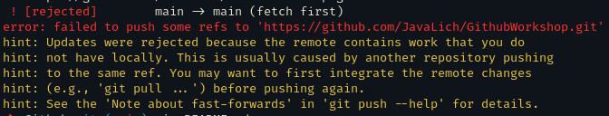
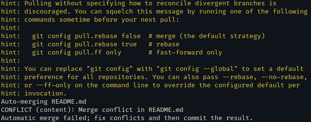

Change

- Cloning a repository clone the repository onto your computer (different than downloading it directly)
```
git clone <link>
```

- Switch to different branch
    1. if creating a new branch 
    ```
    git checkout -b"<name of branch>"
    ```
    2. if switching to a branch that already exists 
    ```
    git checkout <name of branch>
    ```

- Update local version of repository
    ```
    git pull origin <name of branch>
    ```

- Push changes from local to online repository
    1. adds all changes
    ```
    git add .                                                        
    ```
    2. take added changes and prepare them for pushing
    ```
    git commit -m "<commit message>"    
    ```
    3. integrates changes into online repository
    ```
    git push origin <name of branch>         
    ```
  
- Merge branches
    1. make sure changes are pushed on both branches
    ```
    git checkout <branch you want to update>
    git merge origin <other branch>
    ``` 
    
Merge Conflicts: \
You are trying to push your changes and you get this error: \


First pull:
```
git pull
```

You should get this: \


Why use branches? / How to use branches effectively?

Main branch - Should always be functional
Feature branch - Meant for development
